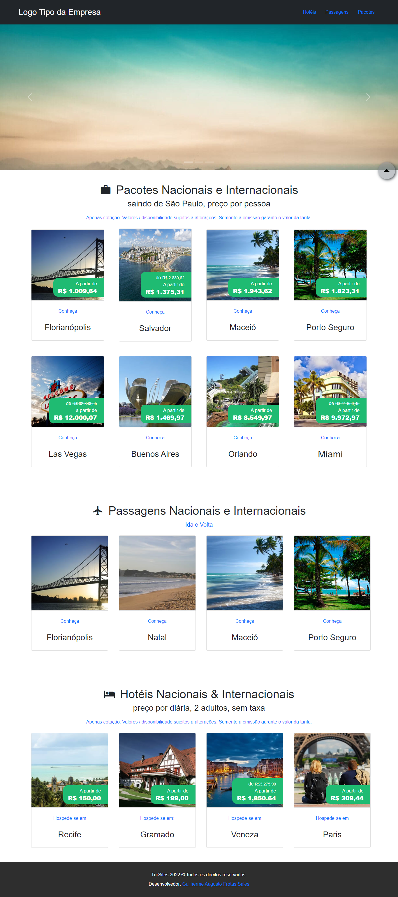

# Agencia de Viagens - Bootstrap

<!---Esses são exemplos. Veja https://shields.io para outras pessoas ou para personalizar este conjunto de escudos. Você pode querer incluir dependências, status do projeto e informações de licença aqui--->




<!--- Linha adicional de texto informativo sobre o que o projeto faz. Sua introdução deve ter cerca de 2 ou 3 linhas. Não exagere, as pessoas não vão ler. --->
> Projeto desenvolvido para solidificar os conhecimentos obetidos durante o segundo modulo do bootcamp full-stack da ReCode Pro. <br/><br/> Enunciado da atividade: " Uma agência de viagens precisa de você para desenvolver uma série de módulos para organizar as informações dos seus clientes, apresentar seus serviços e melhorar os serviços oferecidos aos seus parceiros. "

Para o desenvolvimento da atividade terá de ser utilizado:
- VisuAlg (portugol)
  - Enunciado: Usando conceitos de programação estruturada (Vetor), criar em pseudocódigo um menu para simular um cadastro para uma agência de viagens com as seguintes funções: cadastro de cliente e cadastro de destino, criar também uma consulta para cada estrutura de dados.
- Bootstrap 5 (HTML, CSS e JavaScript)
  - Tarefas descritas no enunciado:
    - Criar um protótipo da primeira versão do site;
    - Criar as páginas: Home, Destino, Promoções, Contato e as demais páginas de acordo com seu modelo de negócio. Usando HTML, CSS e BOOTSTRAP;
    - As páginas devem ser responsivas ou adaptáveis;
    - Faça as formatações de acordo com a paleta de cores escolhida.

### Ajustes e melhorias

O projeto ainda está em desenvolvimento e as próximas atualizações serão voltadas nas seguintes tarefas:
- [X] Desenvolver um sistema para uma agencia de viagens
  - [X] VisuAlg (Algoritmo)
    - [X] ...
  - [X] Bootstar (WebPage)
    - [X] Criar Pagina Inicial
      - [X] Barra de navegação
      - [X] Carousel de Imagens
      - [X] ...

## 💻 Pré-requisitos

Antes de começar, verifique se você atendeu aos seguintes requisitos:
<!---Estes são apenas requisitos de exemplo. Adicionar, duplicar ou remover conforme necessário--->
* Você instalou a versão mais recente do `NodeJS e Git`

## 🚀 Instalando Agencia de Viagens - Bootstrap

Para instalar o Agencia de Viagens - Bootstrap, siga estas etapas:

Linux e macOS:

```
git clone https://github.com/Frotas/recode_modulo_002.git
```

Windows:

```
git clone https://github.com/Frotas/recode_modulo_002.git
```

## ☕ Usando Agencia de Viagens - Bootstrap

Para usar Agencia de Viagens - Bootstrap, siga estas etapas:

Instalando dependencias:

```
cd ./bootstrap/
npm install
```

Iniciando o projeto em selvidor local:

```
npm run start
```

<!-- Adicione comandos de execução e exemplos que você acha que os usuários acharão úteis. Fornece uma referência de opções para pontos de bônus! -->
<!--
## 💻 Comandos Extras:

Para buildar o projeto em modo de desenvolvimento:

```
npm run build
```

-->
<!--
## 🤝 Colaboradores

Agradecemos às seguintes pessoas que contribuíram para este projeto:

<table>
  <tr>
    <td align="center">
      <a href="https://github.com/Frotas/">
        <br>
        <sub>
          <b>Guilherme Augusto</b>
        </sub>
      </a>
    </td>
  </tr>
</table>
-->
## 📝 Licença

Esse projeto está sob licença. Veja o arquivo [LICENÇA](LICENSE.md) para mais detalhes.

<!-- [⬆ Voltar ao topo](#Agencia-de-Viagens-Bootstrap) --> <br>
